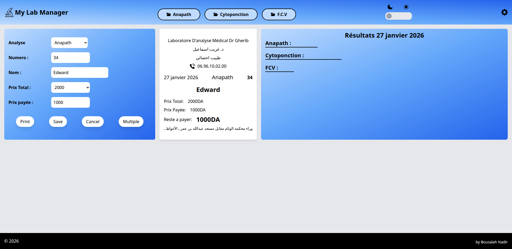
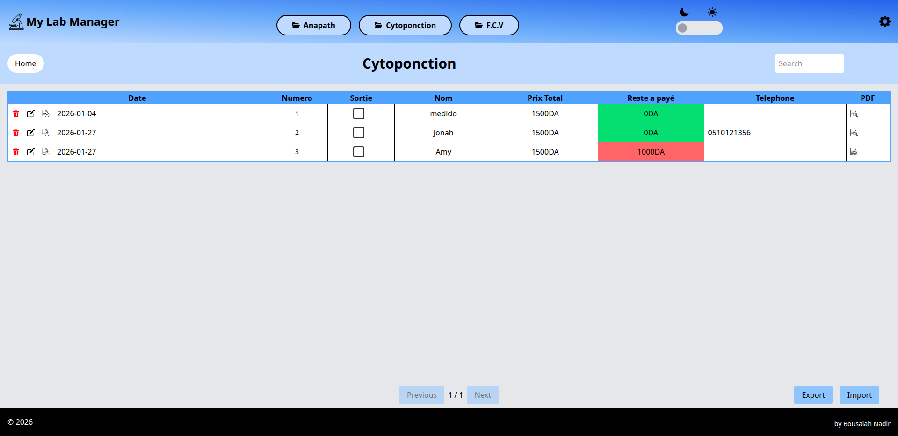

# Lab_manager_frontend
## Table of contents

- [Overview](#overview)
  - [Discription](#the-challenge)
  - [Screenshot](#screenshot)
  - [Links](#links)
- [My process](#my-process)
  - [Built with](#built-with)
- [Author](#author)

## Overview

### Discription

This web application enables efficient client record management, allowing users to add, view, search, edit, and delete client data through an intuitive interface. Client information is securely stored and managed via a backend service powered by PostgreSQL, ensuring data integrity, scalability, and reliability.

The application supports exporting the complete client archive to Excel for offline access and reporting, includes print-ready ticket generation, and offers a dark mode for comfortable viewing. Built with React on the frontend and designed as a Progressive Web App (PWA), it supports offline workflows while seamlessly syncing data when connectivity is restored.

The result is a clean, responsive, and robust system for modern client data management.

### Screenshot

  ## Home Page and ticket generator
  

  ## DateBase
  

### Links

- Live Site URL: [live site](https://officeticketgenerator.netlify.app/)
  Note: This a testing version of this website that uses localStorage for data persistence. The backend is already set up and will be used in the production environment.

## My process

### Built with

- TailwindCSS
- React
- Flexbox
- CSS

## Author

- GitHub - [@Medido1](https://github.com/Medido1)

